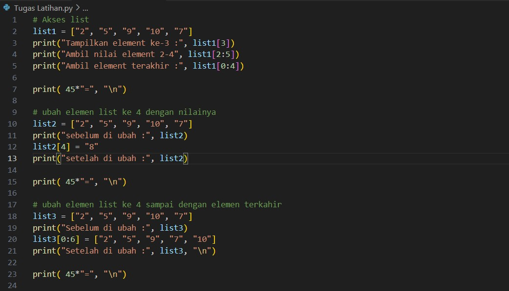
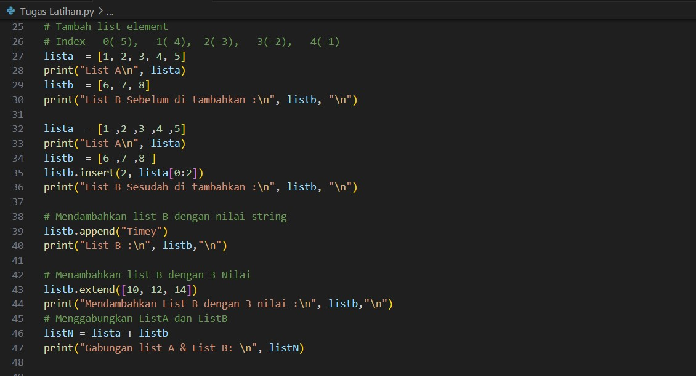
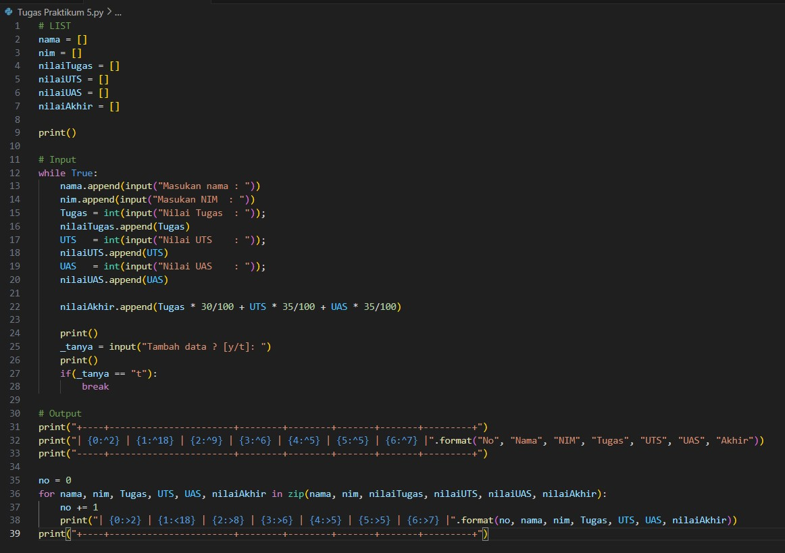
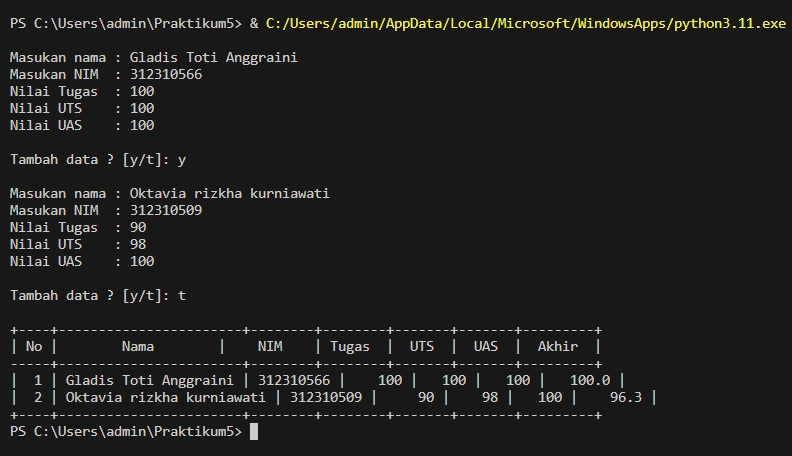
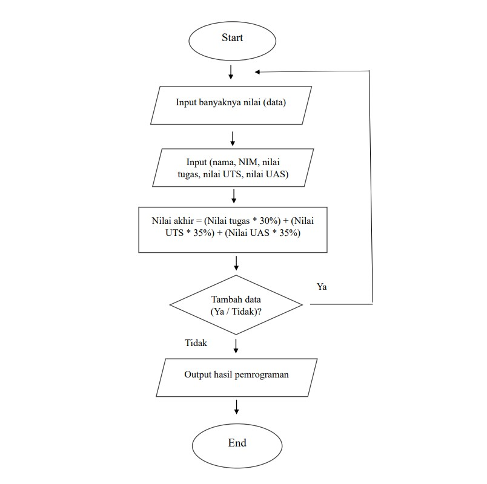

# <strong> Praktikum Python </strong>
>Tugas praktikum 5 Bahasa Pemrograman | Universitas Pelita Bangsa

| Nama                    |  *NIM*           | *Kelas*      |
|:-----------------------:|-----------------:|-------------:|
|*Gladis Toti Anggraini*  | *312310566*      |  *TI.23.A5*  |

# Tugas Latihan

## Membuat list dengan 5 elemen
 

### #Akses List
* list1 = ["2", "5", "9", "10", "7"]: Membuat sebuah list dengan nama list1 yang berisi lima elemen, yaitu string "2", "5", "9", "10", dan "7".

* print("Tampilkan element ke-3 :", list1[3]): Menampilkan elemen ke-3 dari list. Dalam Python, indeks dimulai dari 0, jadi list1[3] merujuk ke elemen ke-4 dari list (indeks 0: "2", indeks 1: "5", indeks 2: "9", indeks 3: "10", dan indeks 4: "7"). Hasilnya adalah "10".

* print("Ambil nilai element 2-4", list1[2:5]): Menampilkan elemen dari indeks 2 hingga indeks 4 (indeks 2, 3, dan 4). Ini disebut slicing di Python. Jadi, list1[2:5] akan menghasilkan sublist ["9", "10", "7"].

* print("Ambil element terakhir :", list1[0:4]): Menampilkan elemen dari indeks 0 hingga indeks 3 (indeks 0, 1, 2, dan 3). Jadi, list1[0:4] akan menghasilkan sublist ["2", "5", "9", "10"].

### #Ubah Elemen List Ke 4 dengan Nilainya

* list2 = ["2", "5", "9", "10", "7"]: Membuat list dengan nama list2 yang berisi lima elemen string: "2", "5", "9", "10", dan "7".

* print("sebelum di ubah :", list2): Menampilkan isi dari list sebelum dilakukan perubahan. Hasilnya akan mencetak elemen-elemen awal dari list2.

* list2[4] = "8": Mengubah nilai elemen pada indeks ke-4 dari list list2. Indeks dimulai dari 0, sehingga list2[4] merujuk ke elemen ke-5 dari list (indeks 0: "2", indeks 1: "5", indeks 2: "9", indeks 3: "10", dan indeks 4: "7"). Dalam kode ini, nilai "7" pada indeks ke-4 diganti dengan nilai "8".

* print("setelah di ubah :", list2): Menampilkan isi dari list setelah dilakukan perubahan. Hasilnya akan mencetak list list2 yang sudah mengalami perubahan nilai pada indeks ke-4.

Sebagai hasilnya, program ini menggantikan nilai "7" pada indeks ke-4 dengan nilai "8", dan kemudian menampilkan list setelah perubahan.

### #Ubah Elemen List Ke 4 sampai dengan Nilai Terakhir

* list3 = ["2", "5", "9", "10", "7"]: Membuat list dengan nama list3 yang berisi lima elemen string: "2", "5", "9", "10", dan "7".

* print("Sebelum di ubah :", list3): Menampilkan isi dari list list3 sebelum dilakukan perubahan. Hasilnya akan mencetak elemen-elemen awal dari list3.

* list3[0:6] = ["2", "5", "9", "7", "10"]: Mengganti sebagian elemen dalam list3 mulai dari indeks 0 hingga indeks 5 (indeks 0, 1, 2, 3, 4, dan 5) dengan list baru ["2", "5", "9", "7", "10"]. Operasi ini menggunakan teknik slicing untuk mengganti sebagian elemen list dengan list lainnya.

* print("Setelah di ubah :", list3, "\n"): Menampilkan isi dari list list3 setelah dilakukan perubahan. Hasilnya akan mencetak list list3 yang sudah mengalami perubahan pada sebagian elemennya.

 Elemen pada indeks 0 diganti dengan "2".
 Elemen pada indeks 1 diganti dengan "5".
 Elemen pada indeks 2 diganti dengan "9".
 Elemen pada indeks 3 diganti dengan "7".
 Elemen pada indeks 4 diganti dengan "10".
 Elemen pada indeks 5 diganti dengan "10" 
 (indeks 5 diikutkan dalam slicing, meskipun biasanya di Python indeks akhir tidak diikutkan).

### #Tambah List Elemen
* Buat list pertama (A)
 lista  = [1, 2, 3, 4, 5]
 print("List A\n", lista)
 listb  = [6, 7, 8]
 print("List B Sebelum di tambahkan :\n", listb, "\n")
 Pada bagian ini, dua list, yaitu lista dan listb diinisialisasi. lista berisi angka 1 sampai 5, sedangkan listb berisi angka 6 sampai 8.

* Penambahan sublist lista[0:2] ke dalam listb pada indeks 2
 lista  = [1 ,2 ,3 ,4 ,5]
 print("List A\n", lista)
 listb  = [6 ,7 ,8 ]
 listb.insert(2, lista[0:2])  
 print("List B Sesudah di tambahkan :\n", listb, "\n")
 Pada bagian ini, dua elemen pertama dari lista (yaitu lista[0:2] atau [1, 2]) dimasukkan ke dalam listb pada indeks 2 menggunakan metode insert.

* Penambahan nilai string "Timey" ke dalam listb
 listb.append("Timey")
 print("List B :\n", listb,"\n")
 Pada bagian ini, string "Timey" ditambahkan ke dalam listb menggunakan metode append.

* Menambahkan list B dengan 3 Nilai
 listb.extend([10, 12, 14])
 print("Mendambahkan List B dengan 3 nilai :\n", listb,"\n")
 Pada bagian ini, tiga nilai (10, 12, 14) ditambahkan ke dalam listb menggunakan metode extend.

* Menggabungkan ListA dan ListB 
 listN = lista + listb
 print("Gabungan list A & List B: \n", listN)
 Pada bagian ini, lista dan listb digabungkan menjadi list baru listN menggunakan operator +.

# Tugas Praktikum 

* Inisialisasi List:
 nama = []
 nim = []
 nilaiTugas = []
 nilaiUTS = []
 nilaiUAS = []
 nilaiAkhir = []

 Membuat beberapa list kosong (nama, nim, nilaiTugas, nilaiUTS, nilaiUAS, nilaiAkhir) yang akan digunakan untuk menyimpan data mahasiswa.

* Input Data Mahasiswa:
 while True:
    nama.append(input("Masukan nama : "))
     nim.append(input("Masukan NIM  : "))
     Tugas = int(input("Nilai Tugas  : ")); 
     nilaiTugas.append(Tugas)
     UTS   = int(input("Nilai UTS    : ")); 
     nilaiUTS.append(UTS)
     UAS   = int(input("Nilai UAS    : ")); 
     nilaiUAS.append(UAS)

     nilaiAkhir.append(Tugas * 30/100 + UTS * 35/100 + UAS * 35/100)

     _tanya = input("Tambah data ? [y/t]: ")
    if(_tanya == "t"):
        break

 Program menggunakan perulangan while untuk terus meminta input data mahasiswa sampai pengguna memilih untuk tidak menambahkan data lagi (_tanya == "t"). Setiap input data disimpan dalam list yang sesuai, dan nilai akhir dihitung berdasarkan bobot tugas, UTS, dan UAS yang diberikan.

* Output Tabel Data Mahasiswa:
 print("+----+-----------------------+--------+--------+-------+-------+---------+")
 print("| {0:^2} | {1:^18} | {2:^9} | {3:^6} | {4:^5} | {5:^5} | {6:^7} |".format("No", "Nama", "NIM", "Tugas", "UTS", "UAS", "Akhir"))
 print("-----+-----------------------+--------+--------+-------+-------+---------+")
 no = 0
 for nama, nim, Tugas, UTS, UAS, nilaiAkhir in zip(nama, nim, nilaiTugas, nilaiUTS, nilaiUAS, nilaiAkhir):
 no += 1    
 print("| {0:>2} | {1:<18} | {2:>8} | {3:>6} | {4:>5} | {5:>5} | {6:>7} |".format(no, nama, nim, Tugas, UTS, UAS, nilaiAkhir))
 print("+----+-----------------------+--------+--------+-------+-------+---------+")

 Program mencetak tabel dengan format yang rapi untuk menampilkan data mahasiswa, termasuk nomor urut, nama, NIM, nilai tugas, nilai UTS, nilai UAS, dan nilai akhir. Ini menggunakan fungsi format untuk memformat output tabel.
 Sebagai hasilnya, program ini memberikan antarmuka sederhana untuk memasukkan data mahasiswa, menghitung nilai akhir, dan menampilkan data dalam bentuk tabel.

## Flowchart

1. Program dimulai dengan menginisialisasi list data_mahasiswa untuk menyimpan data mahasiswa.
2. Didefinisikan fungsi hitung_nilai_akhir untuk menghitung nilai akhir berdasarkan proporsi yang diberikan.
3. Program menggunakan perulangan while True untuk terus meminta input data.
4. Pengguna diminta untuk memasukkan nama, nilai tugas, nilai UTS, dan nilai UAS.
5. Nilai akhir dihitung menggunakan fungsi hitung_nilai_akhir dan data dimasukkan ke dalam list.
6. Program menanyakan apakah pengguna ingin menambahkan data lagi, dan perulangan berlanjut jika jawabannya 'y', jika tidak maka 't'.
7. Setelah selesai memasukkan data, program menampilkan daftar data mahasiswa dalam format tabel sederhana.

